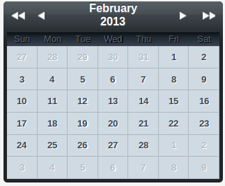

# Calendar Component for Vaadin

# This project has reached End-Of-Life (EOL) and is no longer maintained.

SimpleCalendar is a simple calendar component for Vaadin.

The component supports the following features:
* Selecting multiple dates by control click
* Range selection with shift click
* Keyboard navigation with arrow keys
* Possibility to disable certain dates
* Date tooltips
* Limit start and end dates of calendar
* Selecting multiple locales

A demo of the component can be found at https://apps-johndevs.rhcloud.com/simplecalendar/

A prebuilt addon can downloaded from http://vaadin.com/addon/simplecalendar
